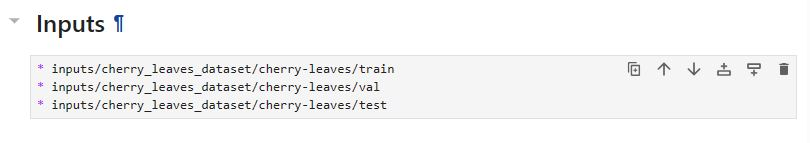
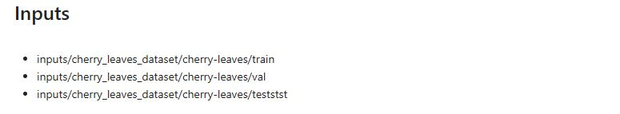

# Cherry Leaves Project
View the live project [here]()
## Introduction
Farmy & Foods have been struggling with the trying to keep their cherry trees healthy by preventing the spread of mildew. Therefore, they have decided on training a model using over 4000 images of healthy and diseased (containing mildew) leaves. They will be used to differentiate between the leaves. Currently, a sample must be taken and manually checked to see if the plant is diseased. This model would mean they could take a random sample and simply upload an image

## Plan

### Business Requirements

1. The client is interested in having a study to visually differentiate between healthy and diseased leaves.
2. The client is interested in telling whether a specific leaf has mildew or not.

### Hypothesis and how to validate?

1. Healthy leaves do not have any specks on them therefore they can be detected by the lack of specks.
   * The average and standard deviation plot shows this. The powdery_leaves will have specks on them whereas hhe healthy leaves do not. 

2. The model can be trained to a high degree of 95%.
   * Train the model (Convolutional Neural Network (CNN))
   * Loss and accuracy plots are plotted to show if there is any under or over fitting
   * The model is successful as it has a high degree of accuracy (<99%). 
   * The loss and accuracy plots show a normal fit.

### Map the business requirements to the Data Visualisations and ML tasks
The CRoss Industry Standard Process for Data Mining (CRISP-DM) was used. 

1. Business Understanding
    - What does the client need?
    - Detect the differences in the leaves
    - Visualise the differences in the leaves
2. Data Understanding
    - Do we have the data?
    - We have the correct data set using Kaggle
3. Data Preparation
    - How to organise the data?
    - Split into Train, Test and Validation sets
    - Augment data to ensure a variety of different images from different angles
4. Modelling
    - What model and what tehcniques are used?
    - This is a classification model
    - Deep learning models are used specifically Convolutional Neural Networks (convolution, polling, flatten, dense, dropout)
5. Evaluation
    - Is it performing correctly?
    - Loss/Accuracy Plots will show if there is over or underfitting and is tested on this
6. Deployment
    - Can the customer/client view the model?
    - Streamlit is used to display all plots and montages.
    - Client can upload their own images.

### ML Business Case
1. Which industries will it be used for?
    - The industries include agriculture, nature parks, biology and any amateur interests.
2. What ML model will be used?
    - A binary classification model can be used. Since it is a split between healthy and powdery leaves.
    - A Convolutional Neural Network is used.
3. Does the client need a dashboard?
    - The client requires a dashboard.
4. What is a successful outcome?
    - Client will be able to see the images of healthy and powdery images
    - Predict whether a specific leaf is healthy or powdery
5. Is it possible to seperate the project into User Stories and Epics?
    - Yes, see User Stories below
6. Are there any privacy or ethical concerns?
    - The client has intended for this open to anybody who is interested including amateur enthusiasts. 
    - The images do not have anything regarding people. 
7. What are the inputs and outputs?
    - Inputs are images of leaves
    - Outputs are a classification of the lead
8. How will the customer benefit?
    - The customer will be able to detect many images at once rather than manually looking at each leaf. This will save the time of the customer. 
9. Who is the User Demographic?
    - This project started because of farmers. However, it can be used also for the following
      * Park Rangers
      * Wildlife Experts
      * Amateur Wildlife Enthusiasts

### User Stories
The following User Stories were created and this is how they applied to each business requirement. (The number represents to the User Story number)
#### User Stories applicable to Business Requirement 1
1. As a data collector, I can collect the images of leaves so that I can differentiate between healthy and diseased cherry leaves.
2. As a data analyst, I can clean the data by removing non-images so that I do not have data that is not compatible with this project.
3. As a data analyst, I can display images so that I can show the customer the data set of leaves.
4. As a data analyst, I can augment the data so that I can the model can be trained with different types of images since not all images will be from the same angle.

#### User Stories applicable to Business Requirement 2
5. As a Machine Learning Engineer, I can create a classification model so that I can predict the classification of a leaf and class it as healthy or diseased.
6. As a machine learning engineer, I can train the model so that it can find a patterns in the dataset.
7. As a machine learning engineer, I can test the model so that I can make sure the model can also find patterns in data it has not seen before
8. As a Machine Learning Product Manager, I can design a dashboard so that I can display the data to my client as per the business requirements.
9. As a Machine Learning Project Manager, I can develop the dashboard so that I can present the data to client.

#### User Stories applicable to both Business Requirements
10. As a client, I can use the dashboard so that I can quickly and accurately tell if a tree has diseased or healthy leaves.
11. As a engineer/client I can view the live page so that I can use it to detect mildew on leaves 

You can view the Kanban Board along with the Epics created [here](https://github.com/users/fatimamahate/projects/12/views/1)

### Goals
* To increase the speed of the testing of leaves. 
* Reduce the manual process of finding specifically diseased leaves.
* Have a higher degree of accuracy compared to manual testing. 

## Features

### Dashboard Design
#### Page 1 - Project Summary
* Introduction and information
* Dataset for Project
* Link to README
* Business Requirements
#### Page 2 - Visualize Leaves
* Business Requirement 1
  * Difference between average and standard deviation of image
  * Difference between diseased healthy leaves
  * Image montage
#### Page 3 - Mildew Detector
* Business Requirement 2
* Download images button
* File uploader widget to add own images for prediction
* Table with prediction results
* Download button to download the results
#### Page 4 - Hypothesis/Validation
* Project Hypothesis 1
  * Validation
* Project Hypothesis 2
  * Validation
#### Page 5 - ML Prediction
* Labels for Train, Validation and Test Sets
* Model History - Accuracy and Losses - underfitting and overfitting
* Model Evaluation result 

## Features to Implement
* Use this model for problems in other fields such as detecting cancer in the medical field.
* Detect something which looks like mildew but is not actually

## Features not implemented
* Since the client would eventually like this to be sent to other farmers, was deemed to be not needed. 
    - it could be implemented if it becomes very popular so that it is a free to use service but only people genuinely interested could use the service. 
  
## Manual Testing

## Credits
### Code
#### split-folders
I was struggling to split my data set into Train, Validation and Test sets. Therefore, I used [this](https://stackoverflow.com/questions/57394135/split-image-dataset-into-train-test-datasets) Stack Overflow post or specifically [this answer](https://stackoverflow.com/a/63118451). I learnt how to use split-folders which was a quicker way to split your data. However, it should be noted that it is encouraged to use the longer method since this shows exactly how splitting the data works. I would recommend split-folders to anybody who wants to work efficiently and is using classes. The code in the specific post was edited to work with my project.
#### Git push
At one point early on, my code would not push to my repository. To troubleshoot, I searched the internet and found [this](https://stackoverflow.com/questions/45293263/git-updates-were-rejected-because-the-tip-of-your-current-branch-is-behind) helpful Stack Overflow post. I needed some extra information despite the error message in my terminal giving instructions. In the end, I specifically used [this answer](https://stackoverflow.com/a/74548526). I felt it was okay to use this command since I was using it early in my project. 
#### gitignore
Some files had to be dropped from the repository and should have been in the gitignore file. I used [this post](https://stackoverflow.com/questions/13541615/how-to-remove-files-that-are-listed-in-the-gitignore-but-still-on-the-repositor) to find a way to do this. I specifically used [this answer](https://stackoverflow.com/a/34435207) since the other answers did not work for me. 

### Content/Media

* The data set is from [Kaggle](https://www.kaggle.com/datasets/codeinstitute/cherry-leaves). It has over 4000 images to train, test and validate the model.
* The project idea is from [Code Institute](https://codeinstitute.net/?nab=1) as well the template used for this project.

## Main Data Analysis and Machine Learning Libraries

* This model is a classification model since the client would like to classify the images into healthy and unhealthy

## Unfixed Bugs

* For unknown reasons, in the 02-DataVisualize.ipynb, when running the 5th cell (beneath inputs), there is a typo for the file path. It is not seen when editing however when I press shift + enter there are 2 extra letters at the end of the file path (st). I have tried rewriting that cell in different ways, but it would always remain in some form. 

## Deployment

### Heroku

* The App live link is: <https://YOUR_APP_NAME.herokuapp.com/>
* Set the runtime.txt Python version to a [Heroku-20](https://devcenter.heroku.com/articles/python-support#supported-runtimes) stack currently supported version.
* The project was deployed to Heroku using the following steps.

1. Log in to Heroku and create an App
2. At the Deploy tab, select GitHub as the deployment method.
3. Select your repository name and click Search. Once it is found, click Connect.
4. Select the branch you want to deploy, then click Deploy Branch.
5. The deployment process should happen smoothly if all deployment files are fully functional. Click now the button Open App on the top of the page to access your App.
6. If the slug size is too large then add large files not required for the app to the .slugignore file.

## Acknowledgements (optional)

* Thank you to Code Institute for the Walkthrough Project (Malaria Detector) which I used for this project as well as the Streamlit calculator lessons

## Codeanywhere Template Instructions

Welcome,

This is the Code Institute student template for Codeanywhere. We have preinstalled all of the tools you need to get started. It's perfectly ok to use this template as the basis for your project submissions. Click the `Use this template` button above to get started.

You can safely delete the Codeanywhere Template Instructions section of this README.md file,  and modify the remaining paragraphs for your own project. Please do read the Codeanywhere Template Instructions at least once, though! It contains some important information about the IDE and the extensions we use. 

## How to use this repo

1. Use this template to create your GitHub project repo

1. Log into <a href="https://app.codeanywhere.com/" target="_blank" rel="noreferrer">CodeAnywhere</a> with your GitHub account.

1. On your Dashboard, click on the New Workspace button

1. Paste in the URL you copied from GitHub earlier

1. Click Create

1. Wait for the workspace to open. This can take a few minutes.

1. Open a new terminal and <code>pip3 install -r requirements.txt</code>

1. In the terminal type <code>pip3 install jupyter</code>

1. In the terminal type <code>jupyter notebook --NotebookApp.token='' --NotebookApp.password=''</code> to start the jupyter server.

1. Open port 8888 preview or browser

1. Open the jupyter_notebooks directory in the jupyter webpage that has opened and click on the notebook you want to open.

1. Click the button Not Trusted and choose Trust.

Note that the kernel says Python 3. It inherits from the workspace so it will be Python-3.8.12 as installed by our template. To confirm this you can use <code>! python --version</code> in a notebook code cell.

## Cloud IDE Reminders

To log into the Heroku toolbelt CLI:

1. Log in to your Heroku account and go to *Account Settings* in the menu under your avatar.
2. Scroll down to the *API Key* and click *Reveal*
3. Copy the key
4. In the terminal, run `heroku_config`
5. Paste in your API key when asked

You can now use the `heroku` CLI program - try running `heroku apps` to confirm it works. This API key is unique and private to you, so do not share it. If you accidentally make it public then you can create a new one with _Regenerate API Key_.

## Business Requirements

* 1 - The client is interested in conducting a study to visually differentiate a healthy cherry leaf from one with powdery mildew.
* 2 - The client is interested in predicting if a cherry leaf is healthy or contains powdery mildew.

